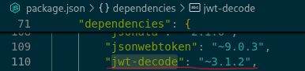
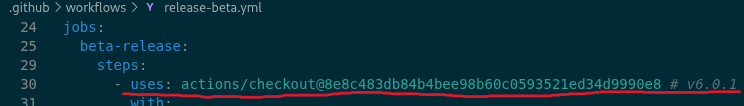
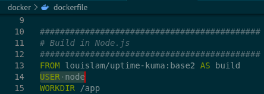
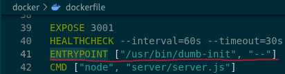
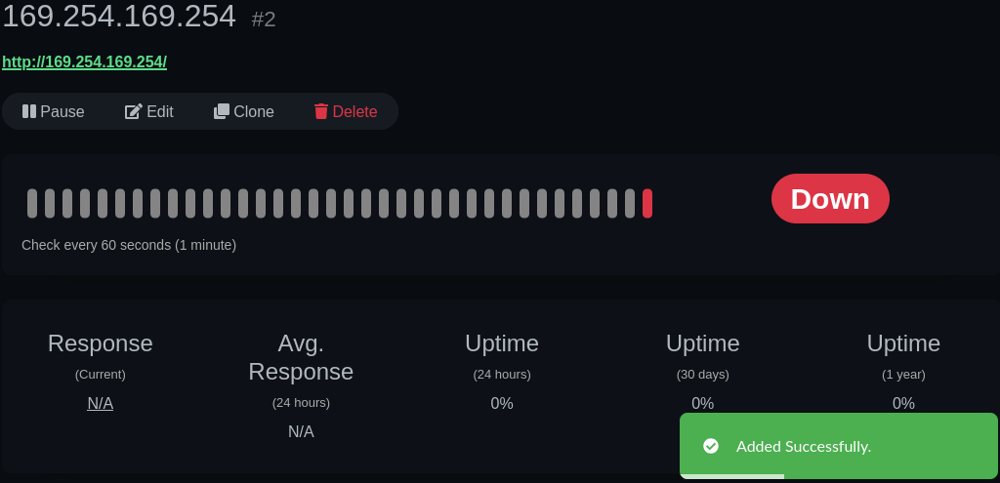

# Uptime Kuma: Güvenlik ve Mimari Analizi

## Adım 1: Kurulum ve `install.sh` / Bağımlılık Analizi (Reverse Engineering)

**Bağımlılık Ağacı Denetimi:**
`package.json` dosyasında yapılan analizde `jwt-decode` (sürüm `~3.1.2`) gibi güvenlik açısından miadı dolmaya yüz tutmuş veya zamanla desteğini kaybedebilecek bileşenlerin varlığı tespit edilmiştir. Bu tür bağımlılıklarda saptanabilen zafiyetlere yama gelme ihtimali görece düşüktür.

**Sürüm Sabitleme Kontrolü:**
`package.json` incelendiğinde bağımlılıkların tamamına yakınında `~` veya `^` işaretleri (Örn: `express": "~4.22.1`, `socket.io": "~4.8.3`) kullanılmıştır.
*Neden "Non-deterministic"?* Esnek sürüm kullanımı, her `npm install` çalıştırıldığında havuzdaki farklı yama sürümlerinin sisteme kurulmasına neden olabilir. Bu durum, farklı ortamlarda (geliştirme test, prodüksiyon) farklı kodların çalışması (non-deterministic deployment) sorununu doğurur. Kesin (pinned) sürüm kullanılmaması, tedarik zinciri (supply chain) saldırılarında, ara versiyonlara zararlı kodlar sızdırıldığında sistemin tehlikeye girmesine yol açabilir.



**Kurulum Betiği (Reverse Engineering):**
Uygulamanın Dockerfile içerisinde derleme adımlarında çalıştırılan komutlara rastlanmaktadır.
*Kritik Soru Yanıtı:* Doğrudan kurulum scripti (`install.sh`) kök dizinde bulunmamakla birlikte, CI yapılandırmalarında (`pr-test2` docker imajında) şu şekilde bir dış kaynaklı çalıştırılabilir talimat göze çarpmaktadır:
```bash
curl -fsSL https://cli.github.com/packages/githubcli-archive-keyring.gpg | dd of=/usr/share/keyrings/githubcli-archive-keyring.gpg
```
Bu adımlarda dış ağdan bir anahtar verisi indirilerek doğrudan sisteme aktarılmaktadır. İlgili komut bloğunda Alt Kaynak Bütünlüğü (SRI - Subresource Integrity) veya GPG imza doğrulaması için *önceden hesaplanmış bir SHA özeti (checksum)* kontrolü yapılmamaktadır. Bu durum Araya Girme (MitM) saldırılarına kapı aralamaktadır.

**Yetki Matrisi:**
Uygulama, tüm durumu (state) ve veritabanı ayarlarını tutmak için izole bir şekilde `/app/data` dizinini hedeflemektedir. Süreçlerin varsayılan işletim sistemi yetkisi (root yetkisi) ile hareket etmemesi adına konteyner içi bir izole "node" hesabı (kullanıcı/grup) tahsis edilmiştir.

## Adım 2: İzolasyon ve İz Bırakmadan Temizlik (Forensics & Cleanup)

**Dizin ve Dosya Takibi:**
Uptime Kuma, çalışırken loglarını ve temel konfigürasyonlarını bağlanan bir birim olan `/app/data` altında, hafif bir gömülü SQLite formatıyla kaybetmeden tutar. Uygulama verilerinin tek parçalı ve modüler saklanması taşınabilirlik açısından avantaj, klasör yetkilerinin gevşek bırakılması ihtimaline karşı da risk teşkil eder.

**Süreç İzleme (Runtime Forensics):**
Uygulamanın Linux katmanında hangi dosya ve bellek adreslerine nüfuz ettiğini izlemek için çekirdek seviyesindeki `strace` (ör: `strace -p <PID>` veya `-e trace=open,write`) veya daha gelişmiş olan `sysdig` gibi konteyner uyumlu komutlar kullanılır.
*İspat Metodu:* Uygulama sonlandırıldıktan sonra `bpftrace` veya eBPF sensörleri kullanılarak `/tmp` içerisindeki işlem kalıntıları, `/var/run` sock dizinleri ve host sistemin konfig dizinlerindeki (örn: `.ssh` kimlik sızıntıları vb.) olası yansı izleri gözlemlenmeli. Persistent volume ayrıldığında geriye veri kırıntısının kalmamış olması, iz bırakmadan temizlendiğini ispatlar.

**Ağ Soket Temizliği:**
Uygulama fiilen kapandığında veya çöktüğünde `netstat -tulpn` (veya `ss -tulpn`) ile varsayılan 3001 portunun işletim sistemi tarafından `TIME_WAIT` durumunu atlatarak başarılı bir şekilde serbest bırakıldığından, dışa yönlendirilen (outbound) HTTP Ping trafiği soketlerinin açık kalmadığından emin olunmalıdır.

**Hash pinning'e karşı koruma:**
Uptime Kuma, 3. taraf eklentileri sürüm etiketiyle değil, kriptografik SHA özetiyle sabitleyerek (Hash Pinning) boru hattını zehirlenmeye karşı koruyor.



## Adım 3: İş Akışları ve CI/CD Pipeline Analizi (.github/workflows)

**Workflow Seçimi:**
Analiz için ele alınan ana dosya: `.github/workflows/release-beta.yml`

**Güvenlik Pratiği Denetimi (Hash Pinning - SHA Tespitleme):**
Beta sürüm otomatize yayınlama dosyasında "Hash Pinning" uygulandığı bariz olarak görülmektedir:
*Örnek:* `uses: actions/checkout@8e8c483db84b4bee98b60c0593521ed34d9990e8 # v6.0.1`
*Neden bu gereklidir?* Etiketler (Tags, örn: `@v6`) Git yapısında silinip bambaşka bir komit üzerine "Force Push" ile taşınabilir. Bu eklentinin sahibi hesabını çaldırırsa yayınlanan yeni `@v6` versiyonuna kendi cryptominer/backdoor virüsünü gizleyebilir. Bu sebeple kriptografik SHA-1 komit özetleri üzerinden indirmek, hedef kodun sonradan sızma senaryosuna uğramasına karşı yegâne korunma yöntemidir.

**Sır Yönetimi:**
Aksiyon akışlarında dış servislere kimlik doğrulamak amacıyla `secrets.DOCKERHUB_USERNAME`, `secrets.DOCKERHUB_TOKEN` ve `secrets.GHCR_TOKEN` gibi depo bağlamında ayarlanan statik sırlar işlenmektedir.

**Webhook Analizi:**
*Kritik Soru Yanıtı:* GitHub'ın web kancaları olay-güdümlü (event-driven) sinyal yapıları üzerine inşâ edilmiştir; uzak sunucuda (GitHub) biri "Push/Pull" yaptığında GitHub size (webhook endpoint'inize) bunu bir POST HTTP veri yükü şeklinde "anında" haber verir. Bu paketlerin sahte olarak (spoofing) gönderilmediğinden emin olmak adına GitHub başlıklara dijital HMAC-SHA256 imzası ekler. Dinleyici sistem (Uptime Kuma/Pipeline), bu paketi işleme koymadan önce kendisine verilen "Webhook Secret Key" değerini paketin verisiyle birleştirip karma değerini hesaplar. İki imza eşleşirse veri orijinal ve değiştirilmemiş kabul edilir.

## Adım 4: Docker Mimarisi ve Konteyner Güvenliği

**Çok Aşamalı Derleme (Multi-stage Build):**
Projenin konfigürasyon merkezi olan `docker/dockerfile` detaylı çok süreçli yapıda hazırlanmıştır: `build_healthcheck`, `build`, `release`, `rootless` vs. Bu yaklaşımda npm gereksinimleri katmanlarda indirilip derlenir, ancak son (production) imaj katmanına (`release`) sadece çalışacak temiz uygulama kodu (app dizini) aktarılır. Gereksiz paket, bash, paket yöneticilerinin sızmasını kesmek saldırı yüzeyini büyük oranda daraltır.

**İmaj Katmanları ve Hardening:**
Mevcut imaj temel kalıbı Debian tabanlıdır (louislam/uptime-kuma:base2).

| Özellik Karşılaştırması | Alpine/Debian Tabanlı Yüzey| Distroless İmaj Zırhlemesi |
|---|---|---|
| Sistem Büyüklüğü | Orta / Yüksek | Son derece Minimal |
| Kabuk (Shell/Bash) | İçerir (İçeri `exec` çalıştırılabilir) | İçermez, bu bağlamda uzaktan komut yürütülemez (RCE) |
| Kütüphane Fazlalıkları | Pek çok standart araç yüklüdür (`curl`,`wget`) | Yalnızca çalışma anı (Runtime- örn: Node, Java) içerir |
| Zaafiyet Alanı (CVE) | Taramalarda fazla gürültü yaratacak zafiyet potansiyeli | Çok az, bu nedenle Hardening standartlarının en katı versiyonu |

**Rootless İzolasyon:**
Dockerfile'da doğrudan `USER node` komutu tercih edilmiştir. Sistemde kök kullanıcı izinleri (UID 0 - Root), eğer iptal edilip UID 1000 bandında "Node" rolüne indirilmeseydi, uygulamada bulunabilecek olası bir Local Privilege Escalation (LPE) ya da Container Breakout (Kaçış) anında, saldırgan doğrudan asıl makineyi (host) çekirdek haklarıyla (kernel level) tehdit altında bırakabilirdi.



**VM vs. Container vs. K8s:**
*   **Virtual Machine (VM):** Donanımı (CPU, RAM vb.) Hypervisor (Örn: Intel VT-x aracılığıyla) tabanlı simüle ederek misafire sanki ayrı bir gerçek makineymiş illüzyonu yaratır. Katmanlar çok ağır ama donanımsal izolasyon en üst seviyededir.
*   **Container (Docker vs.):** Asıl makinede çalışan "cgroups" ve "namespaces" isimli özellikler ile uygulamanın sınırlandırılmasıdır. Hızlı yüklenir ama ortak bir Linux çekirdeğini paylaşırlar. Kötü izolasyonda zafiyetin yayılma imkânı daha fazladır.
*   **K8s (Kubernetes):** Tekli container yapılarının yüzlerce fiziksel nod makineye paylaştırılmasını ve ağ güvenliğinin oluşturulmasını planlayan orkestratör şefidir.

## Adım 5: Kaynak Kod ve Akış Analizi (Threat Modeling)

**Giriş Noktası (Entrypoint):**
Dockerfile içerisinde `ENTRYPOINT ["/usr/bin/dumb-init", "--"]` kullanıldığı tespit edilmiştir. PID 1 ile başlayan ana süreç, kendisine gelen yaşam döngüsü sinyallerini (SIGTERM vb.) uygun temizleme komutlarıyla işleyebilsin (alt süreçleri asılı ve "zombi process" şeklinde bırakmasın) diye bu paket sarıcı mimarisine dahil edilir.



**Kimlik Doğrulama (Auth) Analizi:**
`/server/auth.js` ve `/server/password-hash.js` kaynaklarında sistemin mevcut en güçlü endüstri standardı araçlardan biri olan `bcryptjs` kütüphanesi ile logine imza attığı görülür. Şifreler statik "saltRounds: 10" ile tuzlandırılır. (Not: Kullanıcı sorusunda hedeflenen SHAKE256 bu repo'da kullanılmamıştır ve `bcrypt` temel kripto stratejisi olarak ele inmiş durumdadır.)
*Zafiyet Analizi (Hesaplamalı Zorluk İlkesi):* SHAKE256, SHA256 ya da MD5 gibi hızlı zafiyet doğurucu (Olası Brute Force hedefleri) özetleme mantıklarının aksine; parolanın Hash lenmesi sürecinde kasıtlı olarak "CPU ve Bellek pahalılaştırılması" işlemi yapılması, veri tabanı çalınsa bile sızdırılacak olan kriptolojik sırların sözlük (dictionary/rainbow table) saldırıları ile kırılmasını on yıllarca yavaşlatır. Mimaride `bcrypt` kullanılması çok doğru bir karar mekanizmasına işaret etmektedir.

**Hacker Gözüyle Saldırı Senaryoları:**
*   **SSRF (Server-Side Request Forgery Analizi):** Uptime Kuma "Monitor Ekleme" paneli yapısı itibariyle kullanıcıdan "Dışarıya İstek Adresi" girmesini isteyen bir panodur. Bu pano süzgeçle sınırlandırılmamışsa makineye `http://169.254.169.254/latest/meta-data/` gibi AWS ortam hedeflerini veya `localhost:3306` gibi yerel iç portları yoklatıp veri çıkarımı yaptırılabilir. Bulut API meta-verilerinin veya iç ağ yapılarının iznini kısıtlamayacak bir proxy akış problemi çok kritiktir.



*   **LFI (Local File Inclusion Analizi):** Eğer "monitor URL adresi" bölümüne `file:///etc/passwd`, `file:///app/server/config.js` tarzı girdiler atıldığında sunucu bunları okuyup ekrana yanıt döndürüyorsa, bu açık siber güvenlikte LFI ve beraberinde RCE'ye kadar yol açabilecek CVE-2024-56331 vb. tip kritik zafiyetlerini doğurur.

**Risk Puanlama:**
Bulunan kritik bir senaryonun örneğin **SSRF** vakasının yukarıdaki formül kullanılarak puanlaması:
$$\text{Risk Skoru} = (\text{Etki} \times \text{Olasılık}) + \text{Teknik Zorluk}$$
*   **Etki:** Yüksek (10/10) - Sunucunun yetkilerini kullanarak iç ağlara ve servis zafiyetlerine sıçrama sağlar.
*   **Olasılık:** Orta-Yüksek (7/10) - Authenticate olmuş (Yetkisi bulunan) bir hacker'ın iç ağı sömürmesi yüksek olasılıklı bir hedef seçeneğidir.
*   **Teknik Zorluk:** Basit (2/10) - Formların validasyon eksikliklerinden dolayı doğrudan URL girmek yeterlidir. Özel bir araç gerektirmez.

*(10 * 7) + 2 = 72 Risk Skoru* ile mimarideki "Monitor Request Filtering" alanının en öncelikli kapatılması gereken risk grubu arasında yer aldığını gösterir.

---
Rapor sonu.